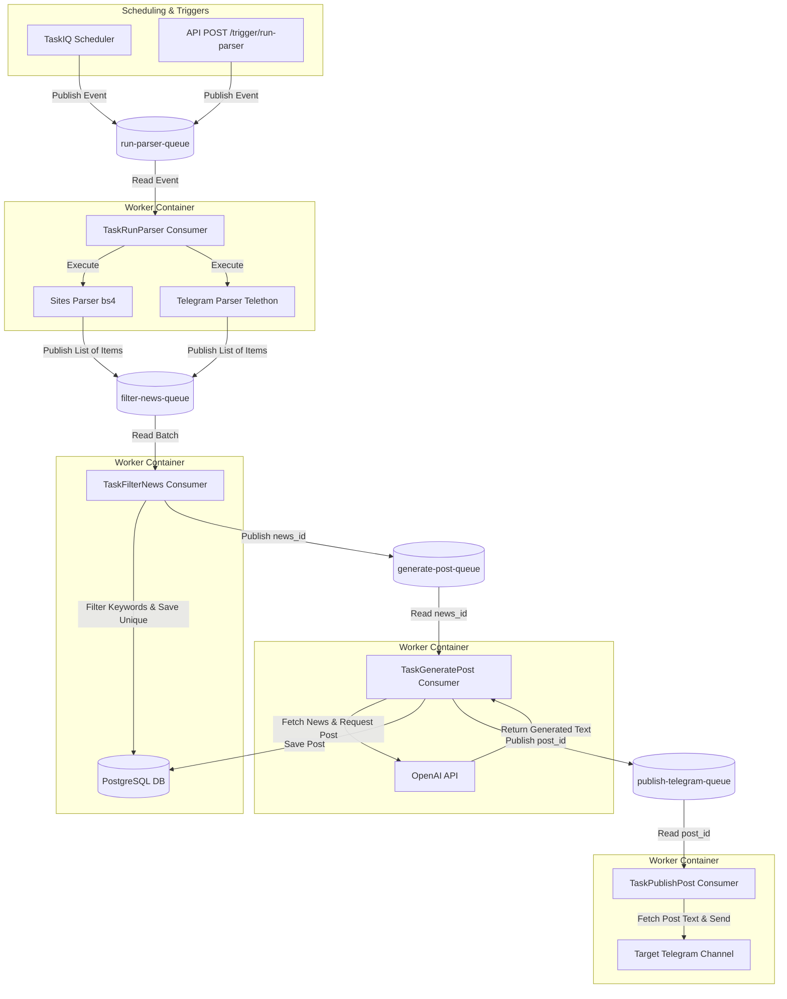

# AI Telegram Post Creator

An automated news aggregation, AI post-generation, and Telegram publishing system.

It periodically parses configured web pages (using BeautifulSoup4) and Telegram channels (using Telethon), filters incoming news by keywords, uses OpenAI to write styled posts based on matching news, and publishes them to a target Telegram channel.

---

## 🏗️ Architecture & Data Flow

The system is built on an event-driven architecture using **FastStream** and **RabbitMQ** to decouple parsing, filtering, AI generation, and publishing tasks.



### Tech Stack

* **API Framework:** FastAPI
* **Task Queue & Routing:** FastStream + RabbitMQ
* **Database:** PostgreSQL (with SQLAlchemy + Asyncpg + Alembic migrations)
* **Scheduler:** TaskIQ + taskiq-faststream
* **AI Service:** OpenAI API (GPT-4o)
* **Parsers:** BeautifulSoup4, Telethon (Telegram Client)
* **Proxy:** Nginx
* **Package Manager:** uv

---

## 🛠️ Project Structure

```text
├── alembic/              # Database migration scripts & history
├── app/                  # Application source code
│   ├── ai/               # OpenAI generation scripts
│   ├── api/              # FastAPI APIRouter endpoints & schemas
│   ├── models.py         # SQLAlchemy models (Source, NewsItem, Post, Keyword)
│   ├── repositories/     # Database repository patterns
│   ├── tasks/            # FastStream task subscribers (filter, generator, parsers, telegram_publish)
│   ├── telegram/         # Telegram publishing client
│   ├── utils/            # Shared utilities (logger, DB session helpers)
│   ├── api_app.py        # Main FastAPI entry point
│   ├── worker_app.py     # Main FastStream worker entry point
│   └── scheduler_app.py  # Main TaskIQ scheduler entry point
├── tests/                # Pytest unit & integration tests
├── compose.yml           # Base Docker Compose configuration
├── compose.dev.yml       # Development override (debugpy, reload, hot-watch)
├── compose.prod.yml      # Production configuration
├── Makefile              # Shell helper commands
└── pyproject.toml        # Poetry/uv python project specification
```

---

## ⚙️ Environment Configuration

Copy `.env.example` to `.env` and fill in the values:

```bash
cp .env.example .env
```

| Environment Variable | Description |
|---|---|
| `POSTGRES_HOST`, `POSTGRES_PORT`, `POSTGRES_USER`, `POSTGRES_PASSWORD`, `POSTGRES_DB` | PostgreSQL connection details. |
| `RABBITMQ_HOST`, `RABBITMQ_PORT`, `RABBITMQ_USER`, `RABBITMQ_PASS` | RabbitMQ connection details. |
| `OPENAI_API_KEY`, `OPENAI_MODEL` | Credentials for generating posts. |
| `TG_API_ID`, `TG_API_HASH` | Telegram API credentials obtained from `my.telegram.org`. |
| `TG_BOT_API_KEY` | Bot API key obtained from `@BotFather` (used for publishing and auth). |
| `TG_BOT_SESSION_NAME` | The SQLite session file name for the Telegram publisher bot. |
| `TG_USER_SESSION_NAME` | The SQLite session file name for the Telegram user client (used for channel parsing). |
| `TG_PUBLISH_CHANNEL` | Target channel ID (e.g., `-100xxxxxxxxx`) where posts will be published. |

---

## 🚀 Quick Start (Development)

The project leverages `docker compose watch` to sync changes in real time.

### 1. Start Dev Containers

Start all services (Database, RabbitMQ, API, Workers, Scheduler, Nginx) with hot-reloading:

```bash
make doc-start-dev
```

### 2. Access Documentation

* **FastAPI Swagger UI:** [http://localhost:8010/docs](http://localhost:8010/docs)
* **FastAPI API Root:** [http://localhost:8010/api/](http://localhost:8010/api/)
* **pgAdmin (DB GUI):** [http://localhost:8010/pgadmin/](http://localhost:8010/pgadmin/) (check `.env` credentials).
* **RabbitMQ GUI:** [http://localhost:8010/rabbitmq/](http://localhost:8010/rabbitmq/) (check `.env` credentials).

### 3. Stop Environment

```bash
make doc-stop-dev
```

---

## 💾 Database Migrations (Alembic)

When editing models in `app/models.py`, generate and apply database migrations.

### Running inside Docker container

Generate a migration script:

```bash
make doc-migrate m="add new table fields"
```

Apply pending migrations:

```bash
make doc-upgrade
```

### Running locally (on Host using `uv`):

Apply migrations on local port `5433`:

```bash
make db-upgrade
```

Seed a test source into local database:

```bash
make db-seed-test-source
```

---

## 🔌 API Guide

All endpoints are prefix-grouped under `/api`. Paginated list endpoints accept standard `page` and `size` parameters.

### 📋 Sources (`/api/sources`)

Manage the external web pages and Telegram channels to scrape:

* `GET /api/sources/` - Get a paginated list of tracking sources.
* `POST /api/sources/` - Create a new tracking source.
* `GET /api/sources/{source_id}` - Retrieve detailed source configurations by ID.
* `PATCH /api/sources/{source_id}` - Partially update source details (e.g., `enabled` state or url).
* `DELETE /api/sources/{source_id}` - Delete a source from the registry.

### 🔑 Keywords (`/api/keywords`)

Manage keywords used to filter incoming raw news items:

* `GET /api/keywords/` - Get a paginated list of all tracking keywords.
* `POST /api/keywords/` - Add a new keyword.
* `GET /api/keywords/{keyword_id}` - Retrieve details of a specific keyword by ID.
* `DELETE /api/keywords/{keyword_id}` - Delete a keyword.

### 📰 News (`/api/news`)

Review filtered news items saved to the database:

* `GET /api/news/` - Get a paginated list of news items (sorted newest first).
* `DELETE /api/news/{news_id}` - Delete a specific news item.

### ✍️ Posts (`/api/posts`)

Inspect posts generated by OpenAI and queue status:

* `GET /api/posts/` - Get a paginated list of all posts (sorted newest first).
* `GET /api/posts/errors/` - Get a paginated list of all posts that failed during generation or publishing.
* `DELETE /api/posts/{post_id}` - Delete a specific post.

### ⚡ Manual Triggers (`/api/trigger`)

Asynchronously queue processes using RabbitMQ:

* `POST /api/trigger/run-parser?source={site|tg}` - Execute site parsing or Telegram channel parsing in the background.
* `POST /api/trigger/repost/{news_id}` - Manually enqueue an existing news item for post generation and publication.
* `POST /api/trigger/republish/{post_id}` - Manually enqueue an existing post for publication.

### 📊 Monitoring (`/api/monitoring`)

* `GET /api/monitoring/summary` - Get operational statistics including total counts of sources (and enabled count), keywords, news, and posts, grouped by status (e.g. `generated`, `published`, `failed`), and the 5 most recent failed posts.

---

## 🧪 Running Tests

Unit tests are written with `pytest` and `pytest-asyncio`.

To run all tests from the host using your virtual environment:

```bash
PYTHONPATH=. uv run pytest
```

To run a specific test file:

```bash
PYTHONPATH=. uv run pytest tests/test_telegram_publish_task.py
```
